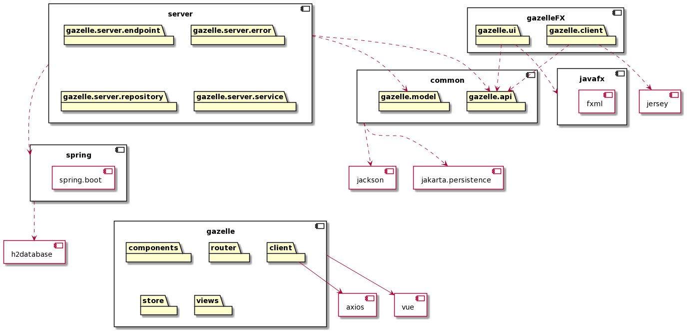

[](https://gitpod.idi.ntnu.no/#https://gitlab.stud.idi.ntnu.no/it1901/groups-2020/gr2010/gr2010) 

# Gazelle


Dette er prosjektet til gruppe 10 i faget IT1901 høsten 2020.
For en komplett beskrivelse av prosjektet se [her](gazelleFX/README.md).

## Organisering
Appen er delt inn i flere moduler: Klient, tjener og delt logikk.
 - Klienten er skrevet i JavaFX og ligger i mappen `gazelleFX/`
 - Tjeneren er skrevet i Spring Boot og ligger i mappen `server/`
 - Delt logikk, slik som objekter og tekst-tolking ligger i `common/`



Tjeneren tar seg av lagring og det meste av prosessering.
Den har et REST-api som klienten bruker for å hente og sende data.

## Bygging og kjøring
Vi bruker maven som byggverktøy, og alle modulene er samlet i toppnivå-`pom.xml`-filen.

For å innstallere alle avhengigheter til den lokale maven-siloen,
samt kompilere og starte prosjektet med både tjener og klient, skriv på Linux, OSX og GitPod:
```
./start.sh
```
Merk at `JAVA_HOME` må være satt til en installasjon av Java 14.

## Testing
For å kompilere, teste og sjekke kodekvalitet på hele prosjektet, skriv:
```
mvn verify
```
For å se testdekningsgrad gå til ```target/site/jacoco/index.html``` i hver modul.

Testene er en kombinasjon enhets- og integrasjonstester.
Med enhetstester mener vi enkeltstående tester av kodeenheter for seg selv.
Integrasjonstetene starter hele programmet og tester at kodeenhetene samhandler på riktig måte.

#### Manuell kjøring
Dersom du vil gjøre det manuelt må du først sørge for at alle dine egne avhengigheter er installert
i din lokale maven-silo.
```
mvn clean install
```

Klient og tjener rekompileres automatisk når du starter dem,
men felles avhengigheter må manuelt rekompileres og legges i maven-siloen.
Hvis du gjør forandringer i `common/` og ikke vil reinstallere alt, skriv:
```
mvn install -pl common
```
Deretter må du starte tjeneren
```
mvn spring-boot:start -pl server
```
Og til slutt starte klienten
```
mvn javafx:run -pl gazelleFX
```
For å skru av tjeneren, send en POST til `/actuator/shutdown`
```
curl -X POST localhost:8080/actuator/shutdown
```

#### Manuell bruk av database
Mens tjeneren kjører, gå til `localhost:8080/h2`. Skriv inn følgende:
 - JDBC URL: `jdbc:h2:file:./database`
 - User Name: `sa`
 - Password: blankt

Her får du tilgang til databasen, og kan legge til og fjerne elementer med SQL.
 
## Bidrag og utvikling

Brukerhistorier ligger [her](/brukerhistorier/brukerhistorier.md).

For prosess og system for bruk av GitLab til smidig utvikling se [CONTRIBUTING.md](/CONTRIBUTING.md).