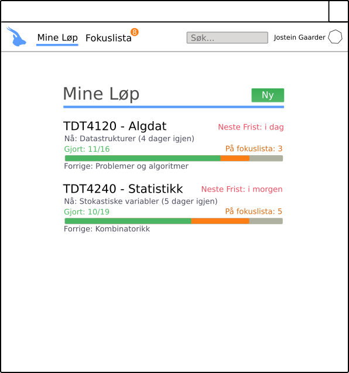
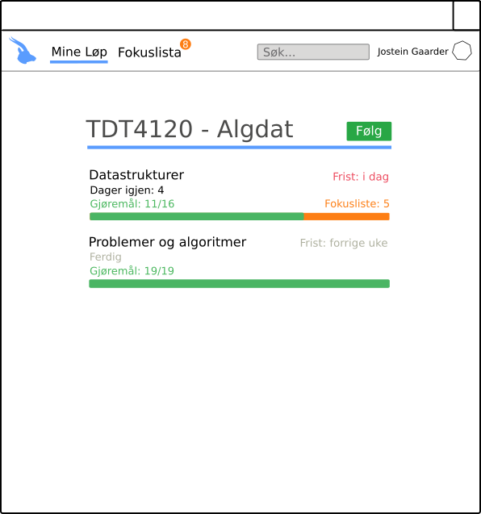
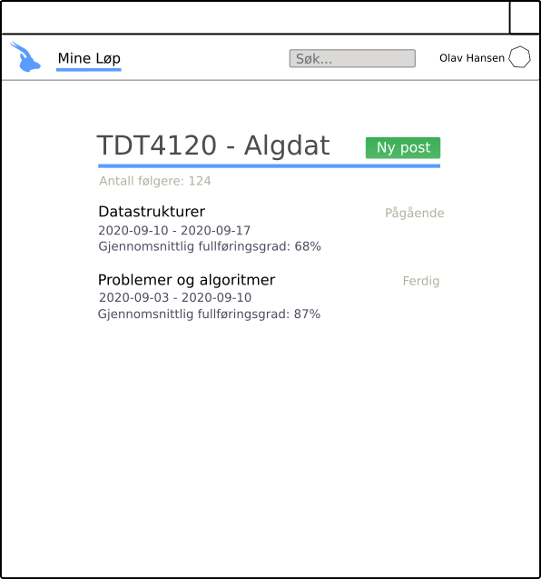
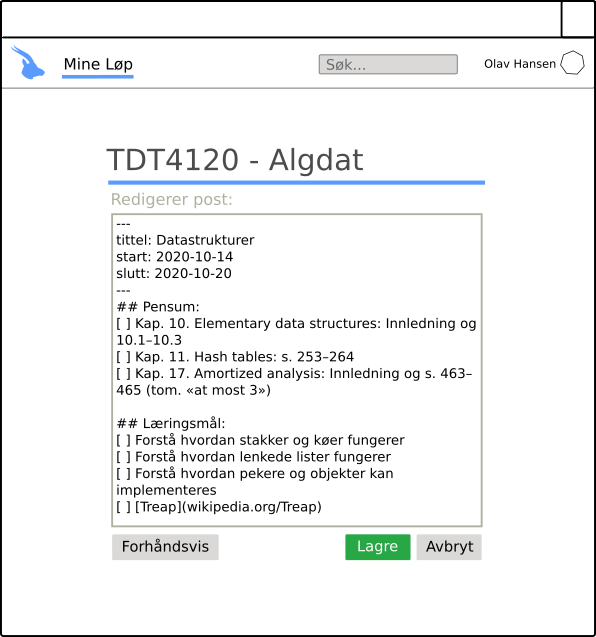

# Brukerhistorier

Her samles alle brukerhistorier, som har som formål å beskrive applikasjonens funksjonalitet. De skal være på formen

```
Som en ___ trenger jeg ___ sånn at jeg ___.
```

Alle brukerhistoriene skal ha en assosiert prioritet, og om de er ferdig implementert eller ikke. De skal også beskrive hva som er viktig å kunne se og gjøre.

## Løp (us-1) &ndash; Høy prioritet

Som en faglærer trenger jeg å opprette nye løp elevene kan følge gjennom semesteret sånn at jeg ikke trenger å lage pensumhefter som elevene må oppdatere seg på manuelt.

Et løp er en beskrivelse av pensum, læringsmål og gjøremål innenfor et fag i form av tema-poster som elever kan registrere seg for å følge.

### Viktig å kunne se

* Liste over alle løp
* Knapp for å legge til nye løp
* Grunnleggende informasjon om løp

### Viktig å kunne gjøre

* Velge løp for å se løpets poster
* Legge til nye løp

### Illustrerende skjermbilde



## Post (us-2) &ndash; Høy prioritet

Som en faglærer trenger jeg å opprette nye poster innen løp sånn at jeg kan publisere nytt pensum, læremål og gjøremål til elevene.

En post er en tidsavgrenset blokk med fokus på en bit av pensum. Her legger faglærer inn både pensum, læringsmål og gjøremål for hver konkrete bit av pensum, som elever kan bruke for å holde oversikt over fremdrift.

### Viktig å kunne se

* Liste over alle poster
* Knapp for å legge til nye poster [Kun for faglærere]
* Grunnleggende informasjon om poster [Forskjellig informasjon ut ifra rolle i løpet (faglærer/elev)]

### Viktig å kunne gjøre

* Velge poster for å se postens informasjon
* Legge til nye poster [Kun for faglærere]
* Redigere poster [Kun for faglærere]

### Illustrerende skjermbilder

#### Liste over poster [Elev]



#### Liste over poster [Faglærer]



#### Redigering av poster [Faglærer]

