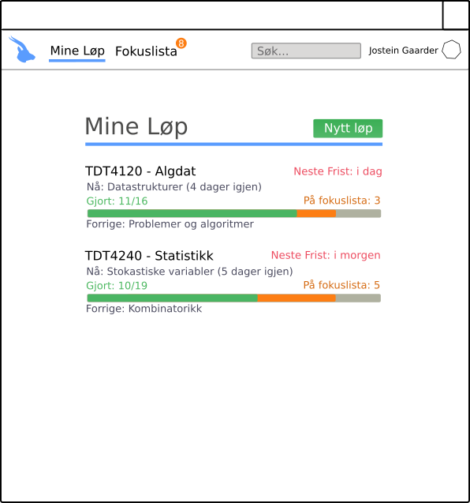

# Brukerhistorier

Her samles alle brukerhistorier, som har som formål å beskrive applikasjonens funksjonalitet. De skal være på formen

```
Som en ___ trenger jeg ___ sånn at jeg ___.
```

Alle brukerhistoriene skal ha en assosiert prioritet, og om de er ferdig implementert eller ikke. De skal også beskrive hva som er viktig å kunne se og gjøre.

## Løp (us-1) &ndash; Høy prioritet

Som en faglærer trenger jeg å opprette nye løp studentene kan følge gjennom semesteret sånn at jeg ikke trenger å lage pensumhefter som studentene må oppdatere seg på manuelt.

Et løp er en beskrivelse av pensum, læringsmål og gjøremål innenfor et fag i form av tema-poster som studenter kan registrere seg for å følge.

### Viktig å kunne se

* Liste over alle løp
* Knapp for å legge til nye løp
* Grunnleggende informasjon om løp

### Viktig å kunne gjøre

* Velge løp for å se løpets poster
* Legge til nye løp

### Illustrerende skjermbilde



## Post (us-2) &ndash; Høy prioritet

Som en faglærer trenger jeg å opprette nye poster innen løp sånn at jeg kan publisere nytt pensum, læremål og gjøremål til studentene.

En post er en tidsavgrenset blokk med fokus på en bit av pensum. Her legger faglærer inn både pensum, læringsmål og gjøremål for hver konkrete bit av pensum, som studenter kan bruke for å holde oversikt over fremdrift.

### Viktig å kunne se

* Liste over alle poster
* Knapp for å legge til nye poster [Kun for faglærere]
* Grunnleggende informasjon om poster [Forskjellig informasjon ut ifra rolle i løpet (faglærer/student)]

### Viktig å kunne gjøre

* Velge poster for å se postens informasjon
* Legge til nye poster [Kun for faglærere]
* Redigere poster [Kun for faglærere]

### Illustrerende skjermbilder

#### Liste over poster [Student]


#### Liste over poster [Faglærer]


#### Redigering av poster [Faglærer]


## Bruker (us-3) &ndash; Høy prioritet

Som både faglærer og student trenger jeg å kunne lage en bruker for
å holde styr på hvilke løp jeg eier og følger, og holde styr på hvilke oppgaver jeg har gjort.

En bruker er en måte å "logge inn" på appen og hvordan man lagrer sin data, slik at man enkelt finner løpene sine.

### Viktig å kunne se

* Hvilken bruker som er logget inn

### Viktig å kunne gjøre
* Logge inne
* Logge ut

### Illustrerende skjermbilde 


## Bruker (us-4) &ndash; Middels prioritet

Som faglærer og brukere ellers trenger jeg å kunne endre innstillingene mine
i appen. Disse innstillingene inkluderer å sette navn og kontaktinfo,
særlig viktig for faglærere.

#### Viktig å kunne se

* En måte å komme seg til innstillinger
* Hvilke innstillinger som gjelder

#### Viktig å kunne gjøre

* Endre innstillingene sine

#### Illustrerende skjermbilde


## Webapp (us-5) &ndash; Høy prioritet

Som bruker og faglærer vil jeg bruke nettleser, slik at jeg slipper å installere programmer.

#### Viktig å kunne se

* Alt som allerede er implementert i JavaFX (us-1 + us-3)

#### Viktig å kunne gjøre

* Alt som allerede er implementert i JavaFX (us-1 + us-3)

## Skille mellom eierskap og følging av løp (us-6) &ndash; Middels prioritet

Som faglærer vil jeg kunne eie løp fra i fjor, uten at de er i veien for årets løp,
slik at jeg lettere har oversikt over hvilke løp som er relevante for semesteret.

#### Viktig å kunne se

* Hvilke løp man følger, og hvilke løp man eier

#### Viktig å kunne gjøre 

* Følge / avfølge alle offentlige og egne løp
* Slette løp man eier

## Administratorbruker (us-7) &ndash; Lav prioritet

Som en administratorbruker vil jeg kunne se, endre og slette alt, 
slik at jeg kan hjelpe faglærerer og studenter dersom de har problemer.

#### Viktig å kunne se

* Oversikt over alle løp
* Oversikt over alle registrerte brukere

#### Viktig å kunne gjøre

* Redigere og slette løp og deltagere
* Redigere og slette poster og gjøremål 

## Fokuslista (us-8) &ndash; Middels prioritet

Som student ønsker jeg enkel oversikt over frister og andre gjøremål som jeg 
burde fokusere på, slik at jeg enkelt kan holde styr på egen fremgang.

#### Viktig å kunne se

* Oversikt over alle gjøremål
* Oversikt over frister (dersom gjøremålet har en frist)

#### Viktig å kunne gjøre

* Huke av gjøremål etter det er gjort
* Velge selv hvilke ting jeg har lyst å fokusere på og dermed legge til i fokuslista


## Nylig endrede løp (us-9) &ndash; Middels prioritet

Som student ønsker jeg å se på fremsiden hvilke av løpene jeg følger som har blitt endret på 
siden sist, slik at jeg kan holde meg oppdatert i fremgangen i faget 
og ikke går glipp av noe

#### Viktig å kunne se

* Nylig endrede løp, i rekkefølge med nyligst øverst. 

#### Viktig å kunne gjøre

* Klikke meg direkte inn på løpet fra denne listen og se den nye endringen.
  