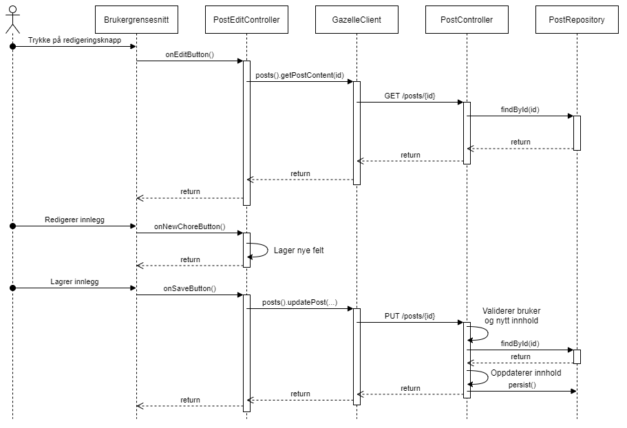

#GazelleFX

Dette er klienten som er skrevet i JavaFX.

##Kjøring

For å starte JavaFX-klienten, skriv
```
mvn javafx:run -pl gazelleFX
```
Merk at tjeneren også må kjøre for å kunne bruke appen fullstendig.

[Les mer her](../README.md)

##Sekvensdiagram

Dette sekvensdiagrammet beskriver prosessen hvor en bruker ønsker 
å redigere et innlegg.

